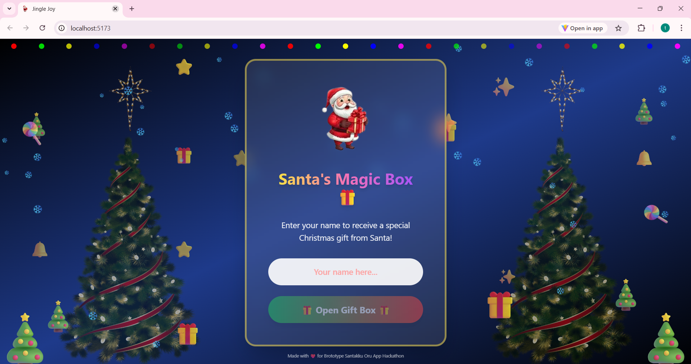
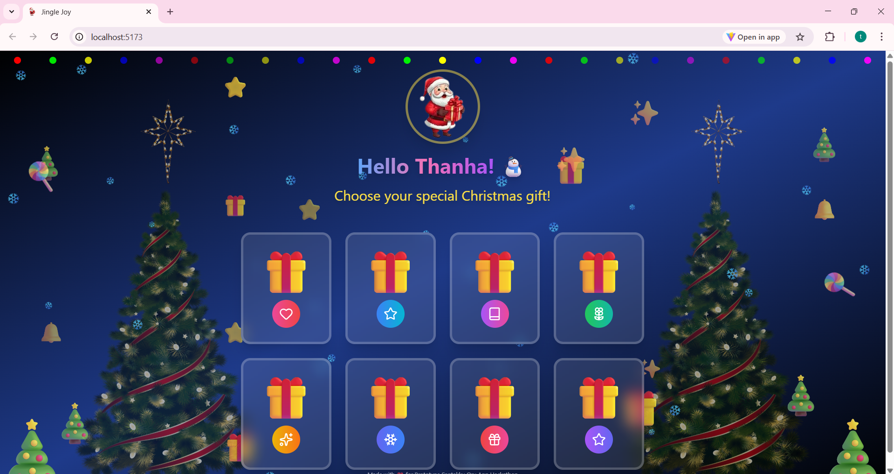

## JINGLE JOY

 JINGLE JOY is an interactive React web app that delivers personalized, heartwarming Christmas gifts and messages. Users enter their name, select a gift, and receive festive messages with animations, snow, lights, and holiday cheer. It's a fun and emotional way to spread happiness during the holiday season.

 ## FEATURES

- Enter your name to receive a personalized Christmas gift.
- Choose from a variety of magical gifts, each with a unique message.
- Heartwarming messages, motivational notes, and short Christmas tales.
- Animated snow, stars, lights, bells, and bouncing gift boxes.
- Share your received gift on WhatsApp with a single click.
- Interactive and visually engaging Christmas-themed UI.


## TECH STACK

 **React** – Frontend library for building the app.
 **TailwindCSS** – Styling and animations.
 **Lucide Icons** – Icons for gifts and decorations.
 **Vite** – Development server and build tool.

## SETUP INSTRUCTIONS

1. Clone the repository
```bash
git clone https://github.com/ThanhaMariyam/Jingle-Joy.git
cd Santa
```

## SCREENSHOTS

## Welcome page


## Preparing gifts


## Select gifts


## Gift Reveal

